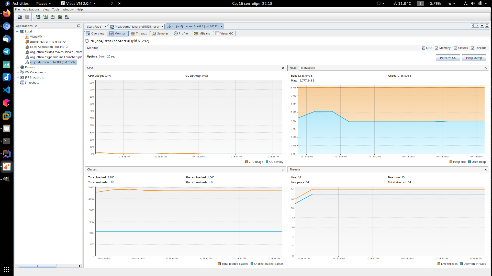
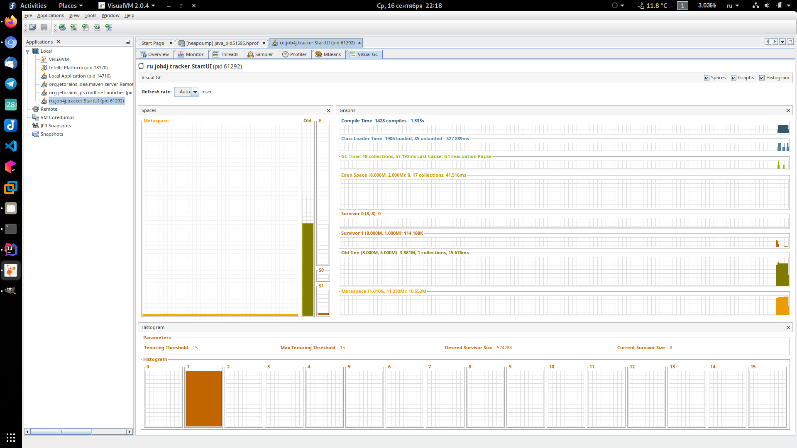
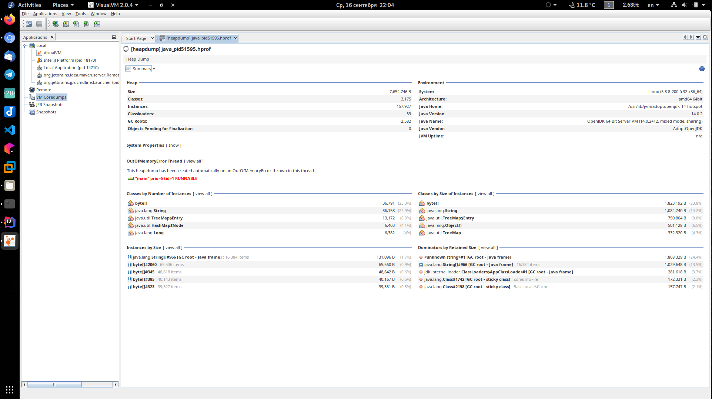

<h5>Анализ работы виртуальной машины</h5>>
Информация получена с помощью программы VisualVM
Можно увидеть параметры размер кучи, загрузку процессора, подробное состояние кучи
 и работу сборщика мусора.





<h5>OutOfMemoryError</h5>>
Дамп кучи снят с помощью параметра -XX:+HeapDumpOnOutOfMemoryError  
По содержанию стэктрейса и информации из дампа можно сделать вывод о том,
в каком классе произошло переполнение и какие объекты заняли память.
В данном случае это массив строк
 
```
java.lang.OutOfMemoryError: Java heap space
Dumping heap to java_pid51595.hprof ...
Heap dump file created [10733954 bytes in 0,125 secs]
Exception in thread "main" java.lang.OutOfMemoryError: Java heap space
	at java.base/java.lang.Integer.toString(Integer.java:442)
	at java.base/java.lang.String.valueOf(String.java:3495)
	at ru.job4j.tracker.Alloc.<p>(Alloc.java:9)
	at ru.job4j.tracker.FindAllAction.execute(FindAllAction.java:15)
	at ru.job4j.tracker.StartUI.init(StartUI.java:13)
	at ru.job4j.tracker.StartUI.main(StartUI.java:39)
```

